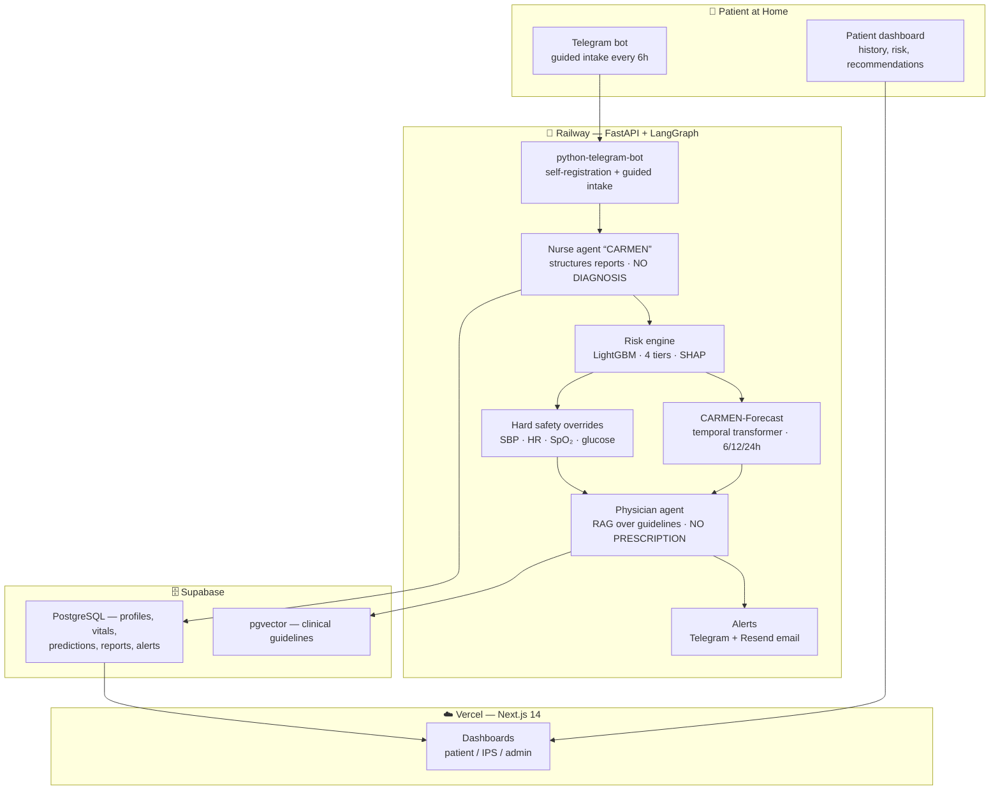
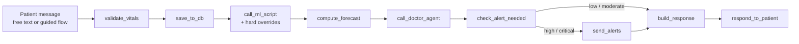

<p align="center">
  
</p>

# CARMEN · HomecareCCV

**Trustworthy, explainable multi-agent AI for cardio-cerebrovascular home
monitoring and triage in low-resource settings** — named after the trusted
caregiver whose vigilance it augments, not replaces.

[](https://t.me/project918_homecare_bot)
[](https://homecare-bice-beta.vercel.app)
[](https://github.com/cmorregof/homecare)
[](https://www.python.org/)
[](https://fastapi.tiangolo.com/)
[](https://nextjs.org/)

Patients report vital signs through Telegram every 6 hours — no app to
install. A virtual nurse structures the report, a risk engine stratifies it
into four action tiers with **deterministic hard safety overrides above any
model**, a physician agent writes a guideline-grounded clinical report (RAG),
a temporal transformer forecasts deterioration for the care team, and
high-risk cases alert the assigned doctor by Telegram and email. A human
clinician is always the final decision-maker.

Research project **56031** (HomecareCCV), Universidad Nacional de Colombia —
Sede Manizales, funded by **Minciencias**, with territorial focus on
Atlántico, Colombia. Presented as poster **P100** at **AIiH 2026, Imperial
College London**.

---

## 🎯 The Clinical Problem

Cardiovascular disease is a leading cause of mortality in Colombia, and many
post-stroke patients live with deficits that require continuous home care. In
practice, clinical teams receive late signals: blood-pressure drift,
hypoxemia, glucose excursions, or neurological deterioration evolve at home
before anyone sees the trend. The monitoring kit costs about **COP 165,000
(~US$50)**: oximeter, BP monitor, thermometer, scale — respiratory rate is
free, you count it.

---

## 🏗️ System Architecture


```mermaid
graph TB
    subgraph Patient["👤 Patient at Home"]
        TG["Telegram bot<br/>guided intake every 6h"]
        WEBPAT["Patient dashboard<br/>history, risk, recommendations"]
    end

    subgraph Backend["🚂 Railway — FastAPI + LangGraph"]
        BOT["python-telegram-bot<br/>self-registration + guided intake"]
        NURSE["Nurse agent “CARMEN”<br/>structures reports · NO DIAGNOSIS"]
        RISK["Risk engine<br/>LightGBM · 4 tiers · SHAP"]
        OVR["Hard safety overrides<br/>SBP · HR · SpO₂ · glucose"]
        FC["CARMEN-Forecast<br/>temporal transformer · 6/12/24h"]
        DOCTOR["Physician agent<br/>RAG over guidelines · NO PRESCRIPTION"]
        ALERTS["Alerts<br/>Telegram + Resend email"]
    end

    subgraph Data["🗄️ Supabase"]
        PG["PostgreSQL — profiles, vitals,<br/>predictions, reports, alerts"]
        VECTOR["pgvector — clinical guidelines"]
    end

    subgraph Frontend["☁️ Vercel — Next.js 14"]
        DASH["Dashboards<br/>patient / IPS / admin"]
    end

    TG --> BOT --> NURSE --> RISK --> OVR
    OVR --> DOCTOR
    RISK --> FC --> DOCTOR
    DOCTOR --> ALERTS
    NURSE --> PG
    DOCTOR --> VECTOR
    PG --> DASH
    WEBPAT --> DASH
```


```mermaid
flowchart LR
    MSG["Patient message<br/>free text or guided flow"] --> VALIDATE["validate_vitals"]
    VALIDATE --> SAVE["save_to_db"]
    SAVE --> PREDICT["call_ml_script<br/>+ hard overrides"]
    PREDICT --> FC["compute_forecast"]
    FC --> DOCTOR["call_doctor_agent"]
    DOCTOR --> CHECK["check_alert_needed"]
    CHECK -->|high / critical| SEND["send_alerts"]
    CHECK -->|low / moderate| BUILD["build_response"]
    SEND --> BUILD
    BUILD --> REPLY["respond_to_patient"]
```

**Design rule:** the nurse agent never diagnoses, and the physician agent
never prescribes or changes treatment. The system explains risk, escalates
alerts, and supports clinical follow-up without replacing medical judgment.

---

## 🛡️ Safety by Construction

Extreme values go **straight to urgent care — no model consulted**.
Deterministic hard overrides sit above every model and can only *raise* the
risk tier, never lower it, on both the ML path and the clinical-rules
fallback:

| Signal | Critical threshold |
|---|---|
| Systolic BP | ≥ 180 or < 80 mmHg |
| Heart rate | > 130 or < 40 bpm |
| SpO₂ | < 88 % |
| Glucose (when reported) | > 400 or < 50 mg/dL |

Every override is covered by a dedicated test table (Tabla A) executed
against the real production model bundle, and surfaces in the clinical
explanation (`override_applied`, `override_factors`).

**Failures are loud, never silent:** a missing or corrupt model bundle logs a
WARNING and degrades to audited clinical rules; the bundle's feature schema is
validated at startup; agent-level exceptions are narrow and logged. The
patient always gets a safe answer; the logs always say what degraded.

---

## 🧠 Risk Stratification

| Level | Label | Meaning | Action |
|---|---|---|---|
| `low` | 🟢 Bajo | Stable vitals | Routine monitoring every 6 h |
| `moderate` | 🟡 Moderado | Mild deviation | Increase vigilance |
| `high` | 🔴 Alto | Significant risk signal | Assigned doctor notified |
| `critical` | 🚨 Crítico | Emergency threshold or severe signal | Urgent care / línea 123 · doctor alerted |

Predictions come from a LightGBM classifier with class probabilities,
confidence score, SHAP values, and top risk factors — then pass through the
hard overrides above. Detailed criteria:
[`docs/estratificacion_riesgo.md`](docs/estratificacion_riesgo.md).

---

## 🔮 CARMEN-Forecast — Will they get worse?

A **tiny temporal transformer** (d=96, 3 layers, 4 heads) consumes the same
seven signals the Telegram intake collects — heart rate, SpO₂, systolic and
diastolic BP, respiratory rate, temperature, weight — binned at the home
cadence of 6 hours, and estimates the probability of clinical deterioration
at **6, 12, and 24 hours**.

- Validated on **MIMIC-IV** (94,458 ICU stays; 1.32M prediction points;
  5-fold GroupKFold by subject): **AUROC 0.78 at 12 h** — *preliminary*:
  trained in ICU, not yet validated on home-reported data, and labeled as
  such everywhere it appears.
- The deployed artifact is a final fit on the canonical run
  (internal-validation AUROC 0.796 / 0.785 / 0.768 at 6/12/24 h), shipped
  with its normalization, config, and provenance
  (`backend/ml/models/carmen_forecast_tfm_home6h.pt`; exporter in the
  research repo).
- **Doctor-facing only.** The forecast is appended to the clinical report and
  never shown to the patient. When p(6h) ≥ 0.5 the assigned doctor gets a
  Telegram notice asking them to verify — a threshold chosen from the
  out-of-fold scores: it fires on 6 % of checkpoints with **PPV 0.61 against
  a 0.19 prevalence**. Configurable via `FORECAST_ALERT_THRESHOLD`.

---

## 🧪 ML Validation on Real Outcomes

Models are validated on **real clinical outcomes by cohort** — never on our
own triage rule. The MEWS/Framingham-style rule is kept as an audited
baseline:

| Cohort | Outcome | Rows | Best model | ROC-AUC | Rule ROC-AUC |
|---|---|---:|---|---:|---:|
| Stroke | `stroke` | 4,253 | Logistic Regression | 0.77 | 0.58 |
| Cardiovascular | `cardio` | 68,651 | Gradient Boosting | 0.80 | 0.72 |
| Heart Failure | `HeartDisease` | 918 | CatBoost | 0.91 | 0.55 |

With leakage guards, calibration curves, decision-curve analysis, subgroup
checks, and cluster-bootstrap intervals. Full artifacts under
[`backend/ml/models/real_outcomes/`](backend/ml/models/real_outcomes/) and
reproducibility notes in [`docs/modelo_real.md`](docs/modelo_real.md).

---

## 🗣️ Conversational Agents — Language Design

The system prompts of both conversational agents (nurse and physician) were
designed using **aggregated statistics** — canonical clinical terms, standard
abbreviations, negation patterns, and section lengths — derived from
**CARMEN-I 1.0.1** (PhysioNet), with access granted under the **CENTINELA**
project. The full style guide lives in
[`docs/guia_estilo_carmen_i_v0.1.md`](docs/guia_estilo_carmen_i_v0.1.md).

- **No text from the corpus is stored in this repository, reproduced in the
  prompts, or sent to external services.** Only aggregate statistics inform
  the prompt design.
- The aggregates were generated locally with an anti-leak verifier.
- The nurse agent uses the aggregates for *comprehension* (recognizing symptom
  families, negations, severity modifiers, and abbreviations in patient
  messages); her voice to the patient remains Colombian, warm, and free of
  jargon. The physician agent uses them for *production* (clinical-note
  structure, pertinent negatives, standard abbreviations).
- A safety evaluation is in progress: 100 clinical vignettes, two blinded
  phases, with a critical-miss endpoint.

---

## 🚀 Key Features

- **Zero-friction onboarding:** scan the QR, send your document number, and
  the bot registers you on the spot — name, account, and an assigned doctor
  (least-loaded assignment), who is notified of the new patient by Telegram.
- **Guided vital-sign intake:** blood pressure, heart rate, respiratory rate,
  SpO₂, temperature, weight, glucose, plus pain / dizziness / dyspnea scores.
  Commands: `/start`, `/registro`, `/vitales`, `/estado`, `/historial`,
  `/emergencia`, `/ayuda`.
- **Free-text Spanish understanding:** "presión 130/85, pulso 78, me siento
  mareado" parses into structured vitals; conversational replies stay warm,
  Colombian, and never diagnose.
- **Explainable risk + hard overrides + forecast** — see the sections above.
- **Clinical RAG:** MINSALUD, AHA/ASA, Framingham-for-Colombia and MEWS
  guideline chunks in Supabase pgvector ground the physician agent's report.
- **Multichannel escalation:** `high`/`critical` tiers alert patient and
  assigned doctor via Telegram and Resend email, with retries and delivery
  bookkeeping; 6-hour monitoring reminders run on América/Bogotá time.
- **Role-based dashboards:** patient, IPS, and admin views (Next.js 14 +
  Supabase Auth + Realtime).

---

## 🛠️ Tech Stack

| Layer | Technology |
|---|---|
| Backend | Python 3.12, FastAPI, LangGraph, python-telegram-bot, APScheduler |
| Agents | OpenAI GPT-4o · prompts informed by CARMEN-I aggregates |
| Risk ML | scikit-learn, LightGBM, XGBoost, CatBoost, SHAP |
| Forecast | PyTorch (CPU) — tiny temporal transformer |
| RAG | OpenAI `text-embedding-3-small` + Supabase pgvector |
| Data & Auth | Supabase (PostgreSQL, Auth, Realtime, RLS) |
| Frontend | Next.js 14, TypeScript, Tailwind CSS, Recharts |
| Alerts | Telegram HTTP API, Resend |
| Deployment | Railway (Docker) backend · Vercel frontend |

---

## 📁 Repository Map

```text
homecare-ccv/
├── backend/
│   ├── agents/               # Nurse + physician LangGraph workflows and prompts
│   ├── api/routes/           # REST endpoints (/health, /ml/predict, /ml/forecast, …)
│   ├── bot/                  # Telegram registration, commands, guided intake
│   ├── db/                   # Supabase client, repository, SQL schema
│   ├── ml/                   # Risk models, hard overrides, forecast inference
│   ├── notifications/        # Telegram + email alert services
│   ├── rag/                  # Embeddings and pgvector retrieval
│   └── tests/                # 58 tests: overrides (Tabla A), registration,
│                             #   forecast, agents, bot, ML pipeline, prompts
├── frontend/                 # Next.js dashboards by role
├── data/                     # ETL and processed cohorts
├── docs/                     # Architecture, deployment, style guide, ops
└── scripts/                  # Env checks, deployment smoke, demo reset/seed
```

---

## 💻 Local Setup

```bash
git clone https://github.com/cmorregof/homecare.git
cd homecare

# Backend
cp backend/.env.example backend/.env      # fill in the secrets
python3.12 -m venv .venv
.venv/bin/python -m pip install torch --index-url https://download.pytorch.org/whl/cpu
.venv/bin/python -m pip install -r backend/requirements.txt
cd backend && PYTHONPATH=. ../.venv/bin/python -m uvicorn main:app --reload

# Frontend
cp frontend/.env.local.example frontend/.env.local
cd frontend && npm install && npm run dev
```

Or with Docker: `docker compose up --build`.

**Tests** (forecast runs in its own process — torch and LightGBM share an
OpenMP runtime on macOS):

```bash
cd backend
../.venv/bin/python -m pytest tests/ --ignore=tests/test_forecast.py
../.venv/bin/python -m pytest tests/test_forecast.py
```

**Deployment smoke:**

```bash
python3 scripts/smoke_deployment.py --backend-url https://<railway-domain>
```

---

## 🚢 Deployment

| Piece | Where | Notes |
|---|---|---|
| Backend | Railway | Docker (`python:3.12-slim` + `libgomp1` + CPU torch); root dir `/backend`; auto-deploys from `main`; health check `/health`; startup validates the model bundle and logs it |
| Frontend | Vercel | Root `frontend/`, Next.js 14 |
| Data | Supabase | Schema in `backend/db/schemas.sql`; demo reset/seed in `scripts/demo_reset_seed.sql` |
| Telegram | webhook | `POST /telegram/webhook/setup` (domain-aware) |

Secrets and full runbooks: [`docs/despliegue.md`](docs/despliegue.md) ·
[`docs/operacion_produccion.md`](docs/operacion_produccion.md).

---

## 📚 Scientific Basis & Data

- **MIMIC-IV 3.1** (PhysioNet) for CARMEN-Forecast development; external
  reconnaissance on NWICU.
- **CARMEN-I 1.0.1** (PhysioNet, under CENTINELA) — aggregate statistics only,
  for agent language design.
- Kaggle cohorts (stroke, cardiovascular, heart failure) for real-outcome
  risk validation.
- Clinical grounding: MINSALUD Colombia 2022–2026, AHA/ASA 2024 secondary
  stroke prevention, Framingham for the Colombian population, MEWS.

Full bibliography: [`docs/bibliografia.md`](docs/bibliografia.md).

---

## 👥 Research Team

**Carlos M. Orrego-Franco** · **Elisabeth Restrepo Parra** (director,
erestrepopa@unal.edu.co) · **Juan Carlos Riaño-Rojas**
Universidad Nacional de Colombia — Sede Manizales, Facultad de Ciencias
Exactas y Naturales. Funded by Minciencias (project 56031, HomecareCCV).
Clinical collaborators, pilot phase: Pablo Benjumea, Juan Camilo Arias.

## 📄 License

License pending definition by the research team and Universidad Nacional de
Colombia.
