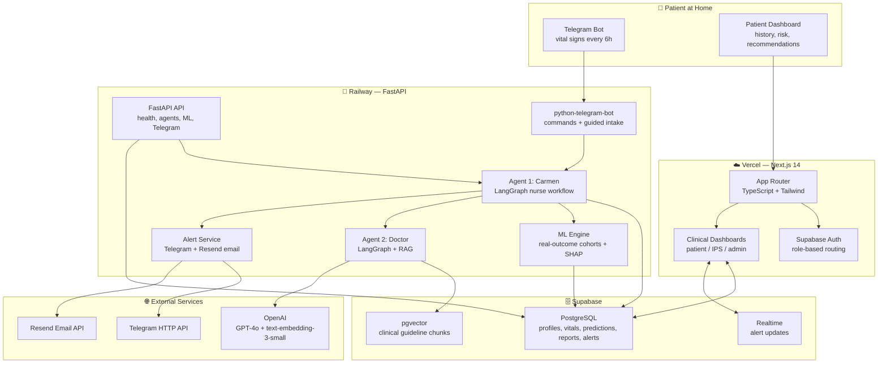
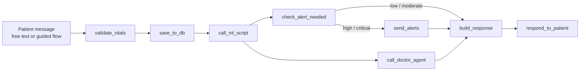

# 🏥 HomecareCCV: AI Agents for Cardio-Cerebrovascular Home Monitoring

*A production-oriented digital health platform for remote monitoring of
cardio-cerebrovascular patients, combining Telegram-based vital-sign intake,
clinical LLM agents, real-time machine learning risk stratification, RAG over
medical guidelines, and role-based clinical dashboards.*

[](https://github.com/cmorregof/homecare)
[](https://t.me/project918_homecare_bot)
[](https://www.python.org/)
[](https://fastapi.tiangolo.com/)
[](https://nextjs.org/)
[](https://www.typescriptlang.org/)
[](https://www.docker.com/)

---

## 🎯 The Clinical Problem

Cardiovascular disease is one of the leading causes of mortality in Colombia,
and many post-stroke patients survive with permanent deficits that require
continuous home care. In practice, clinical teams often receive late signals:
subtle blood-pressure changes, hypoxemia, glucose excursions, dizziness,
dyspnea, or neurological deterioration may evolve at home before anyone sees
the trend.

**HomecareCCV** turns the patient's home into a monitored clinical surface.
Every 6 hours, patients report vital signs through Telegram. A virtual nurse
agent structures the message, a trained ML model estimates risk, a doctor agent
reviews the case with clinical context and RAG, and high-risk cases trigger
multichannel alerts for the patient and the assigned care team.

This repository is based on research project **56031** from Universidad
Nacional de Colombia, Manizales, led by **Dr. Elisabeth Restrepo Parra** and
funded by **Minciencias**, with territorial focus on Atlántico, Colombia.

---

## 🏗️ System Architecture


```mermaid
graph TB
    subgraph Patient["👤 Patient at Home"]
        TG["Telegram Bot<br/>vital signs every 6h"]
        WEBPAT["Patient Dashboard<br/>history, risk, recommendations"]
    end

    subgraph Frontend["☁️ Vercel — Next.js 14"]
        NEXT["App Router<br/>TypeScript + Tailwind"]
        AUTH["Supabase Auth<br/>role-based routing"]
        DASH["Clinical Dashboards<br/>patient / IPS / admin"]
    end

    subgraph Backend["🚂 Railway — FastAPI"]
        API["FastAPI API<br/>health, agents, ML, Telegram"]
        BOT["python-telegram-bot<br/>commands + guided intake"]
        NURSE["Agent 1: Carmen<br/>LangGraph nurse workflow"]
        DOCTOR["Agent 2: Doctor<br/>LangGraph + RAG"]
        ML["ML Engine<br/>real-outcome cohorts + SHAP"]
        ALERTS["Alert Service<br/>Telegram + Resend email"]
    end

    subgraph Data["🗄️ Supabase"]
        PG["PostgreSQL<br/>profiles, vitals, predictions, reports, alerts"]
        VECTOR["pgvector<br/>clinical guideline chunks"]
        REALTIME["Realtime<br/>alert updates"]
    end

    subgraph External["🌐 External Services"]
        OPENAI["OpenAI<br/>GPT-4o + text-embedding-3-small"]
        TELEGRAM["Telegram HTTP API"]
        RESEND["Resend Email API"]
    end

    TG --> BOT
    WEBPAT --> NEXT
    NEXT --> AUTH
    NEXT --> DASH
    DASH <--> PG
    DASH <--> REALTIME
    BOT --> NURSE
    API --> NURSE
    NURSE --> PG
    NURSE --> ML
    NURSE --> DOCTOR
    DOCTOR --> VECTOR
    DOCTOR --> OPENAI
    ML --> PG
    NURSE --> ALERTS
    ALERTS --> TELEGRAM
    ALERTS --> RESEND
    API --> PG
```

---

## 🤖 Agent Flow


```mermaid
flowchart LR
    MSG["Patient message<br/>free text or guided flow"] --> VALIDATE["validate_vitals"]
    VALIDATE --> SAVE["save_to_db"]
    SAVE --> PREDICT["call_ml_script"]
    PREDICT --> DOCTOR["call_doctor_agent"]
    PREDICT --> CHECK["check_alert_needed"]
    CHECK -->|high / critical| SEND["send_alerts"]
    CHECK -->|low / moderate| BUILD["build_response"]
    SEND --> BUILD
    DOCTOR --> BUILD
    BUILD --> REPLY["respond_to_patient"]
```

**Design rule:** the nurse agent never diagnoses, and the doctor agent never
prescribes or changes treatment. The system explains risk, escalates alerts,
and supports clinical follow-up without replacing medical judgment.

---

## 🗣️ Conversational Agents — Language Design

The system prompts of both conversational agents (nurse and physician) were
designed using **aggregated statistics** — canonical clinical terms, standard
abbreviations, negation patterns, and section lengths — derived from
**CARMEN-I 1.0.1** (PhysioNet), with access granted under the **CENTINELA**
project. The full style guide lives in
[`docs/guia_estilo_carmen_i_v0.1.md`](docs/guia_estilo_carmen_i_v0.1.md).

- **No text from the corpus is stored in this repository, reproduced in the
  prompts, or sent to external services.** Only aggregate statistics inform
  the prompt design.
- The aggregates were generated locally with an anti-leak verifier.
- The nurse agent uses the aggregates for *comprehension* (recognizing symptom
  families, negations, severity modifiers, and abbreviations in patient
  messages); her voice to the patient remains Colombian, warm, and free of
  jargon. The physician agent uses them for *production* (clinical-note
  structure, pertinent negatives, standard abbreviations).
- A safety evaluation is in progress: 100 clinical vignettes, two blinded
  phases, with a critical-miss endpoint.

---

## 🚀 Key Features

- **Telegram-first clinical intake:** `/start`, `/registro`, `/vitales`,
  `/estado`, `/historial`, `/ayuda`, and `/emergencia`.
- **Guided vital-sign workflow:** blood pressure, heart rate, oxygen
  saturation, glucose, pain, dizziness, and dyspnea.
- **Validated ML cohorts:** real outcomes for stroke, cardiovascular disease,
  and heart failure, with leakage guards, calibration, decision curves,
  subgroup checks, bootstrap intervals, and SHAP.
- **Explainable risk:** every prediction includes class probabilities,
  confidence score, SHAP values, and top risk factors.
- **Clinical RAG:** guideline chunks stored in Supabase `pgvector`, retrieved
  for the doctor agent before generating structured recommendations.
- **Role-based web app:** patient, IPS, and admin dashboards protected through
  Supabase Auth middleware.
- **High-risk escalation:** `high` and `critical` predictions trigger Telegram
  and email alerts with retry-aware notification services.
- **Production path:** Dockerized backend for Railway, Vercel-ready frontend,
  GitHub Actions, smoke checks, and deployment runbooks.

---

## 🧠 Risk Stratification

HomecareCCV combines clinical rules inspired by **MEWS**, cardiovascular risk
criteria aligned with **Framingham-style factors**, and real-time ML
classification.

| Level | Label | Clinical Meaning | Action |
|---|---|---|---|
| `low` | 🟢 Bajo | Stable vital signs and low short-term deterioration signal | Routine monitoring every 6 hours |
| `moderate` | 🟡 Moderado | Mild deviation or accumulated risk factors | Increase vigilance and monitor persistence |
| `high` | 🔴 Alto | Significant risk signal requiring clinical awareness | Notify assigned medical staff |
| `critical` | 🚨 Crítico | Emergency threshold or severe deterioration signal | Urgent care / Colombian emergency line 123 |

Immediate critical thresholds include systolic BP `> 180` or `< 80`, heart rate
`> 130` or `< 40`, oxygen saturation `< 88%`, or glucose `> 400` or `< 50`.

Detailed criteria are documented in
[`docs/estratificacion_riesgo.md`](docs/estratificacion_riesgo.md).

---

## 🧪 Machine Learning

The validated research pipeline now uses **real clinical outcomes by cohort**
instead of a synthetic `risk_level` target. The previous MEWS/Framingham rule is
kept as an audited clinical baseline, not as the label learned by ML models.

| Cohort | Real Outcome | Rows After Audit | Prevalence | Best Model | ROC-AUC | AUC-PR | Brier | Rule ROC-AUC | Δ Mean Net Benefit vs Rule |
|---|---|---:|---:|---|---:|---:|---:|---:|---:|
| Stroke | `stroke` | 4,253 | 5.8% | Logistic Regression | 0.771 | 0.138 | 0.059 | 0.576 | +0.0007 |
| Cardiovascular | `cardio` | 68,651 | 49.5% | Gradient Boosting | 0.801 | 0.775 | 0.181 | 0.720 | +0.0251 |
| Heart Failure | `HeartDisease` | 918 | 55.3% | CatBoost | 0.907 | 0.909 | 0.123 | 0.546 | +0.1013 |

Why the metrics dropped: the old ~0.99 scores came from learning a deterministic
rule-generated target. The new values are lower because they evaluate real
dataset outcomes on held-out test splits. That is the scientifically valid
result.

Leakage guardrails:

| Cohort | Removed Target-Derived Feature | Near-Constant Features Removed |
|---|---|---|
| Stroke | `stroke_history` | `heart_rate`, `oxygen_saturation`, `cholesterol_level`, `diabetes_history`, `alcohol_intake`, `physical_activity`, symptoms |
| Cardiovascular | `heart_disease_history` | `heart_rate`, `oxygen_saturation`, `stroke_history`, symptoms |
| Heart Failure | `heart_disease_history` | `oxygen_saturation`, `stroke_history`, `smoking_encoded`, `alcohol_intake`, symptoms, `bmi_category` |

Artifacts:

```text
backend/ml/models/real_outcomes/real_outcome_results.json
backend/ml/models/real_outcomes/{stroke,cvd,heart_failure}/best_model.pkl
backend/ml/models/real_outcomes/figures/*.png
data/processed/real_outcomes/{stroke,cvd,heart_failure}.csv
docs/notebooks/homecare_ml_real_outcomes.ipynb
```

The operational Telegram risk endpoint still keeps the legacy rule-risk model
available for four-level triage, but the main scientific ML report is now the
real-outcome cohort evaluation.

See [`docs/modelo_real.md`](docs/modelo_real.md) for reproducibility notes.

---

## 🧬 Clinical Variables

| Group | Features |
|---|---|
| Demographics | `age`, `gender_encoded` |
| Vital signs | `systolic_bp`, `diastolic_bp`, `heart_rate`, `oxygen_saturation`, `glucose` |
| Baseline risk | `bmi`, `cholesterol_level`, `hypertension_history`, `heart_disease_history`, `stroke_history`, `diabetes_history` |
| Habits | `smoking_encoded`, `alcohol_intake`, `physical_activity` |
| Symptoms | `pain_score`, `dizziness_score`, `dyspnea_score` |
| Derived features | `pulse_pressure`, `map`, `bmi_category` |

Full source mapping is documented in
[`docs/variables_clinicas.md`](docs/variables_clinicas.md).

---

## 🛠️ Tech Stack

| Layer | Technology |
|---|---|
| Frontend | Next.js 14, TypeScript, Tailwind CSS, Recharts, lucide-react |
| Auth & DB | Supabase Auth, PostgreSQL, Realtime, pgvector |
| Backend API | Python 3.12, FastAPI, pydantic-settings |
| Agents | LangGraph, OpenAI GPT-4o |
| RAG | OpenAI `text-embedding-3-small`, Supabase pgvector |
| Telegram | python-telegram-bot v20+, APScheduler reminders |
| ML | scikit-learn, imbalanced-learn, LightGBM, XGBoost, CatBoost, SHAP |
| Email | Resend |
| Deployment | Railway backend, Vercel frontend, GitHub Actions |
| Local infra | Docker Compose with pgvector/PostgreSQL |

---

## 📁 Repository Map

```text
homecare-ccv/
├── backend/                  # FastAPI, agents, ML, RAG, Telegram, alerts
│   ├── agents/               # Nurse + doctor LangGraph workflows
│   ├── api/routes/           # REST endpoints
│   ├── bot/                  # Telegram commands and guided intake
│   ├── db/                   # Supabase client and SQL schema
│   ├── ml/                   # ETL-facing model training and prediction
│   ├── notifications/        # Telegram and email alert services
│   └── rag/                  # Embeddings and pgvector retrieval
├── frontend/                 # Next.js dashboards by role
│   ├── app/                  # App Router routes
│   ├── components/           # UI, charts, risk, vitals, alerts, chat
│   └── lib/                  # Supabase and API clients
├── data/                     # Kaggle dataset placeholders, ETL, processed data
├── docs/                     # Architecture, deployment, bibliography, operations
├── scripts/                  # Environment and deployment smoke checks
└── .github/workflows/        # Railway and Vercel CI/CD
```

---

## 💻 Local Setup

```bash
# 1. Clone
git clone https://github.com/cmorregof/homecare.git
cd homecare

# 2. Backend environment
cp backend/.env.example backend/.env
# Fill in: OPENAI_API_KEY, SUPABASE_URL, SUPABASE_SERVICE_KEY,
#          TELEGRAM_BOT_TOKEN, RESEND_API_KEY

# 3. Frontend environment
cp frontend/.env.local.example frontend/.env.local
# Fill in: NEXT_PUBLIC_SUPABASE_URL, NEXT_PUBLIC_SUPABASE_ANON_KEY,
#          NEXT_PUBLIC_API_URL, NEXT_PUBLIC_TELEGRAM_BOT_URL,
#          NEXT_PUBLIC_SITE_URL

# 4. Run local database + backend container
docker compose up --build
```

Run the frontend separately:

```bash
cd frontend
npm install
npm run dev
```

Run the backend directly:

```bash
python3.12 -m venv .venv
.venv/bin/python -m pip install -r backend/requirements.txt
cd backend
PYTHONPATH=. ../.venv/bin/python -m uvicorn main:app --reload
```

---

## 📊 Dataset Pipeline

Download the Kaggle datasets into `data/mock/`:

```bash
pip install kaggle

kaggle datasets download fedesoriano/stroke-prediction-dataset \
  -p data/mock/ --unzip

kaggle datasets download sulianova/cardiovascular-disease-dataset \
  -p data/mock/ --unzip

kaggle datasets download fedesoriano/heart-failure-prediction \
  -p data/mock/ --unzip
```

Build the unified dataset and train:

```bash
PYTHONPATH=backend .venv/bin/python data/etl/unify_datasets.py
cd backend
PYTHONPATH=. ../.venv/bin/python -m ml.train
```

Datasets:

| Dataset | Source | Records | Purpose |
|---|---:|---:|---|
| Stroke Prediction Dataset | Kaggle / Fedesoriano | 5,110 | Stroke risk factors and comorbidities |
| Cardiovascular Disease Dataset | Kaggle / Sulianova | 70,000 | BP, cholesterol, glucose, lifestyle variables |
| Heart Failure Prediction | Kaggle / Fedesoriano | 918 | Complementary cardiovascular risk signal |

---

## 🧪 Quality Checks

```bash
# Backend tests
PYTHONPATH=backend .venv/bin/python -m unittest discover -s backend/tests -v

# Backend compile
python3 -m compileall backend scripts

# Frontend
cd frontend
npm run lint
npm run build
npm run typecheck

# Deployment smoke test
python3 scripts/smoke_deployment.py --backend-url http://127.0.0.1:8000
```

Environment validation:

```bash
python3 scripts/check_env.py --target backend --template backend/.env.example --allow-placeholder
python3 scripts/check_env.py --target frontend --template frontend/.env.local.example --allow-placeholder
```

---

## 🚢 Deployment

**Backend: Railway**

- Deployable from repository root.
- Container: root `Dockerfile`, which packages `backend/`.
- Health check: `/health`
- Telegram webhook setup: `POST /telegram/webhook/setup`
- CI workflow: `.github/workflows/backend_deploy.yml`

**Frontend: Vercel**

- Root directory: `frontend/`
- Framework: Next.js
- CI workflow: `.github/workflows/frontend_deploy.yml`

**Required secrets**

| Service | Variables |
|---|---|
| Backend | `OPENAI_API_KEY`, `SUPABASE_URL`, `SUPABASE_SERVICE_KEY`, `TELEGRAM_BOT_TOKEN`, `RESEND_API_KEY`, `FROM_EMAIL` |
| Frontend | `NEXT_PUBLIC_SUPABASE_URL`, `NEXT_PUBLIC_SUPABASE_ANON_KEY`, `NEXT_PUBLIC_API_URL`, `NEXT_PUBLIC_TELEGRAM_BOT_URL`, `NEXT_PUBLIC_SITE_URL` |
| GitHub Actions | `RAILWAY_TOKEN`, `RAILWAY_SERVICE`, `VERCEL_TOKEN`, `VERCEL_ORG_ID`, `VERCEL_PROJECT_ID` |

Full deployment instructions are in [`docs/despliegue.md`](docs/despliegue.md),
with production operations in
[`docs/operacion_produccion.md`](docs/operacion_produccion.md).

---

## 🏛️ Architecture Decisions

**Why Telegram first?** It minimizes patient friction: no app install, no new
password flow during monitoring, and a familiar channel for older or supported
patients.

**Why LangGraph?** The nurse and doctor workflows are stateful, conditional,
and auditable. A graph makes validation, persistence, ML prediction, RAG,
alerting, and final response explicit.

**Why Supabase + pgvector?** Patient records, clinical reports, alerts, auth,
realtime dashboards, and vector retrieval live in a single managed PostgreSQL
surface without adding a separate vector database.

**Why classical ML before transformers?** The first production phase requires
strong tabular baselines, explainability, and reproducible clinical validation.
Temporal Fusion Transformer / PatchTST is documented as Phase 2, once real
longitudinal data from Atlántico is available.

---

## 📚 Scientific Basis

The project documentation cites clinical and technical references including:

- Tumaini et al. (2025), intensive vital-sign monitoring after stroke.
- Zain et al. (2024), ML prediction for cardio-cerebrovascular readmission.
- Lv et al. (2023), interpretable ML for 30-day stroke readmission.
- Ko et al. (2025), remote vital-sign monitoring in hospital-at-home programs.
- Ministerio de Salud Colombia, cardiovascular and metabolic disease guidelines.
- MedAgents, ClinicalAgents, and LangGraph-based healthcare orchestration work.

See [`docs/bibliografia.md`](docs/bibliografia.md) for the full bibliography.

---

## 👥 Research Team

- **Director:** Elisabeth Restrepo Parra — erestrepopa@unal.edu.co
- **Institution:** Universidad Nacional de Colombia, sede Manizales
- **Faculty:** Facultad de Ciencias Exactas y Naturales
- **Department:** Departamento de Física y Química
- **Funding:** Minciencias, Colombia
- **Project code:** 56031

---

## 📄 License

License pending definition by the research team and Universidad Nacional de
Colombia.
